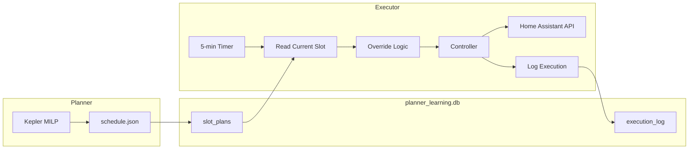
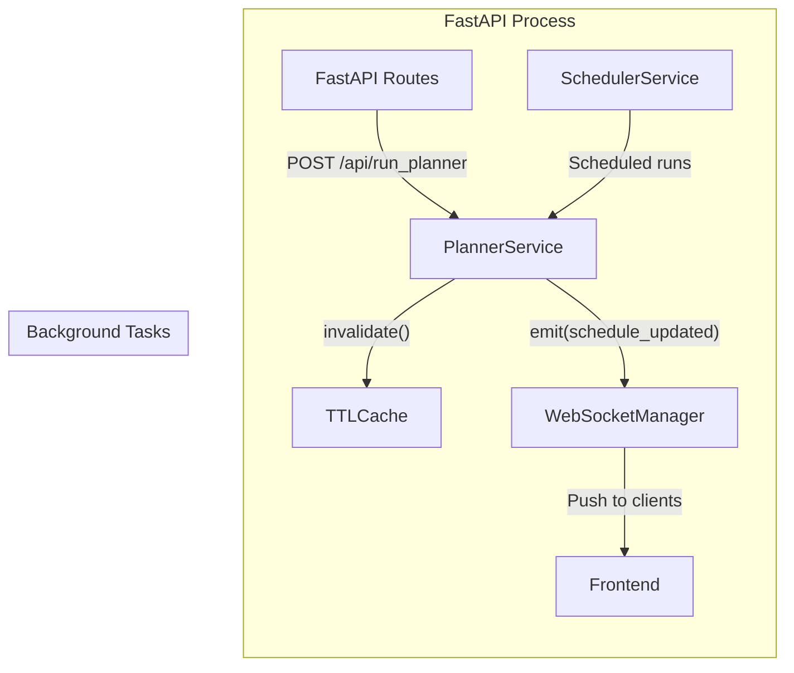

# Darkstar Architecture Documentation

## 1. System Overview
Darkstar is an intelligent energy management system designed to optimize residential energy usage. It uses a **Model Predictive Control (MPC)** approach, combining machine learning forecasts (Aurora) with a Mixed-Integer Linear Programming (MILP) solver (Kepler).

### Core Philosophy
*   **Maximize Value**: Buy low, sell high, and use energy efficiently.
*   **Robustness**: Plan for the worst (High Load/Low PV) using the **S-Index**.
*   **Strategic**: Look ahead (D2+) to make decisions today (Terminal Value).

---

## 2. The Kepler Solver (MILP)
Kepler is the decision-making core. It solves an optimization problem to generate the optimal charge/discharge schedule.

**Solver Engine:**
- **Local/Docker/Add-on**: Uses **CBC (Coin-OR Branch and Cut)** via `PuLP`.
- **Legacy**: Formerly used GLPK, but it is deprecated due to stability issues with complex Mixed-Integer constraints.

### Objective Function
The solver minimizes the total cost over the planning horizon (typically 24-48 hours):
```
Minimize: Sum(Import_Cost - Export_Revenue + Wear_Cost) - (End_SoC * Terminal_Value)
```

### Key Concepts
*   **Hard Constraints**: Physics limits (Battery Capacity, Inverter Power), Energy Balance.
*   **Soft Constraints**: Terminal Value (Incentivizes ending with charge).
*   **Inflated Demand**: The solver sees a "Safety Margin" inflated load (via S-Index) as hard demand it *must* meet.

---

## 3. **Strategic S-Index: Physical Deficit Logic**

As of **REV K23**, Darkstar uses a unified **Physical Deficit** model for the S-Index. This replaces variable inflation and the TVS system with a robust, energy-focused safety floor.

### 3.1 The Safety Floor (Intra-day & Inter-day)
*   **Goal**: Maintain a safety buffer of stored energy exactly proportional to the forecasted risk of outage (Load > PV).
*   **Formula**:
    ```
    Safety Floor (kWh) = Min SoC + Base Reserve + Weather Buffer
    ```
*   **Base Reserve**: `Deficit Ratio * (Capacity * Scaling Limit) * Risk Multiplier`
    *   **Deficit Ratio**: `(Forecasted Load - Forecasted PV) / Forecasted Load` (Clamped at 0).
    *   **Scaling Limit**: Defaults to 50% of capacity.
    *   **Risk Multipliers**:
        *   Level 1 (Safety): **1.30x** (Paranoid coverage)
        *   Level 3 (Neutral): **1.00x** (1:1 coverage)
        *   Level 5 (Gambler): **0.00x** (Only honor hardware Min SoC)

### 3.2 Weather Buffers (Explicit Adders)
Beyond the deficit, specific weather conditions trigger additive buffers:
*   **Cold**: +1.0 kWh for sub-zero, +2.0 kWh for extreme cold (< -10°C).
*   **Snow**: Incremental adder based on snow probability.
*   **Clouds**: +0.5 kWh during heavy cloud cover (prevents PV gambling).

### 3.3 Hard vs Soft Constraints in Kepler
*   **Hardware Min SoC (Hard)**: 1000 SEK/kWh - Physics-based limit to protect battery health.
*   **Safety Floor (Soft)**: **200 SEK/kWh** (Fixed) - Strong strategic incentive. The solver will only violate this floor if the alternative is an extremely expensive grid peak or if it is physically impossible to maintain.

This approach ensures the system is rational: it dumps energy during expensive peaks if the future looks sunny (Low Deficit), but clings to energy if a "Dark Day" (High Deficit) is coming.

---

## 4. Water Heating as Deferrable Load (Rev K17)

The water heater is integrated into Kepler as a **deferrable load**, allowing optimal source selection.

### How It Works
- `water_heat[t]` binary variable in MILP: is heating ON in slot t?
- **Constraint**: Must schedule `min_kwh_per_day` (e.g., 6 kWh)
- **Constraint**: Max gap `max_hours_between_heating` (e.g., 8h)
- **Constraint**: Min spacing `water_min_spacing_hours` (Hard minimum gap between starts) (Rev K16 Option 4)
- **Constraint (Soft)**: "Smart Comfort" Sliding Window (Prevents massive blocks without hard limits)
- **Reliability**: Soft Min kWh constraints (Prevent "Infeasible" crashes if capacity exceeded)
- Water load added to energy balance → Kepler sources from grid or battery

### Source Selection
Kepler sees the full cost picture and decides:
- **Grid**: If `import_price` is cheap
- **Battery**: If `discharge_price + wear_cost < grid_price`
- **PV**: If surplus available (free!)

### Config
```yaml
water_heating:
  power_kw: 3.0
  min_kwh_per_day: 6.0
  max_hours_between_heating: 8  # Ensure heating every 8h
```

---

## 4.1 Vacation Mode (Rev K19)

When vacation mode is enabled, normal comfort-based water heating is disabled and replaced with periodic **anti-legionella cycles** for safety.

### Behavior
| Mode | Normal Heating | Anti-Legionella |
|------|----------------|-----------------|
| Vacation OFF | ✅ Comfort-based (Kepler) | ❌ |
| Vacation ON | ❌ Disabled | ✅ 3h block weekly |

### Anti-Legionella Cycle
- **Duration**: 3 hours at 3kW = 9 kWh (heats tank to 65°C)
- **Frequency**: Every 7 days
- **Scheduling**: After 14:00 (when tomorrow's prices available), picks cheapest slots
- **Smart Detection**: If water already heated today (≥2 kWh from HA sensor), delays first cycle

### Config
```yaml
water_heating:
  vacation_mode:
    enabled: false  # Toggle via Dashboard or HA entity
    anti_legionella_interval_days: 7
    anti_legionella_duration_hours: 3
```

### State Tracking
Uses `vacation_state` table in `planner_learning.db` to track `last_anti_legionella_at` timestamp.

## 5. Aurora Intelligence Suite
Darkstar's intelligence is powered by the **Aurora Suite**, which consists of three pillars:

### 5.1 Aurora Vision (The Eyes)
*   **Role**: Forecasting.
*   **Mechanism**: LightGBM models predict Load and PV generation with 11 features (time, weather, context).
*   **Uncertainty**: Provides p10/p50/p90 confidence intervals for probabilistic S-Index.
*   **Extended Horizon**: Aurora forecasts 168 hours (7 days), enabling S-Index to use probabilistic bands for D+1 to D+4 even when price data only covers 48 hours.
*   **Config**: `s_index.s_index_horizon_days` (integer, default 4) controls how many future days are considered.

### 5.2 Aurora Strategy (The Brain)
*   **Role**: Decision Making.
*   **Mechanism**: Determines high-level policy parameters (`θ`) for Kepler based on context (Weather, Risk, Prices).
*   **Outputs**: Target SoC, Export Thresholds, Risk Appetite.

### 5.3 Aurora Reflex (The Inner Ear)
*   **Role**: Learning & Balance.
*   **Mechanism**: Long-term feedback loop that auto-tunes physical constants and policy weights based on historical drift.
*   **Analyzers**:
    *   **Safety**: Tunes `s_index.base_factor` (Lifestyle Creep).
    *   **Confidence**: Tunes `forecasting.pv_confidence_percent` (Dirty Panels).
    *   **ROI**: Tunes `battery_economics.battery_cycle_cost_kwh` (Virtual Cost).
    *   **Capacity**: Tunes `battery.capacity_kwh` (Capacity Fade).

---

## 5.4 Battery Cost Tracker (Rev F1)

The **Battery Cost Tracker** (`backend/battery_cost.py`) tracks the **weighted average cost** of energy in the battery.

### Why It Matters
Export decisions require knowing what the stored energy is "worth". Exporting at 1.0 SEK makes no sense if the energy cost 1.2 SEK to charge.

### Algorithm (Weighted Average)
```python
# Grid charging: adds expensive energy
new_cost = (old_kwh * old_cost + charge_kwh * import_price) / new_total_kwh

# PV charging: dilutes cost (free energy)
new_cost = (old_kwh * old_cost) / (old_kwh + pv_surplus_kwh)

# Discharge: cost stays same (removing energy, not changing cost/kWh)
```

### Integration
- **Executor** → Updates cost after each slot based on charging source
- **Kepler Solver** → Reads current cost for `wear_cost_sek_per_kwh`
- **Default** → 1.0 SEK/kWh until sufficient data collected

### Storage
Persists in `planner_learning.db` table `battery_cost` with single row (id=1).

## 6. Modular Planner Pipeline

The planner has been refactored from a monolithic "God class" into a modular `planner/` package:

```
planner/
├── pipeline.py           # Main orchestrator (PlannerPipeline)
├── inputs/               # Input Layer
│   ├── data_prep.py      # prepare_df(), apply_safety_margins()
│   ├── learning.py       # Aurora overlay loading
│   └── weather.py        # Temperature forecast fetching
├── strategy/             # Strategy Layer
│   ├── s_index.py        # S-Index calculation (dynamic risk factor)
│   ├── windows.py        # Cheap window identification
│   └── manual_plan.py    # Manual override application
├── scheduling/           # Pre-solver Scheduling
│   └── water_heating.py  # Water heater window selection
├── solver/               # Kepler MILP Integration
│   ├── kepler.py         # KeplerSolver (MILP optimization)
│   └── adapter.py        # DataFrame ↔ Kepler types conversion
└── output/               # Output Layer
    ├── schedule.py       # schedule.json generation
    ├── soc_target.py     # Per-slot soc_target_percent calculation
    └── formatter.py      # DataFrame → JSON formatting
```

### Data Flow


1. **Inputs**: Nordpool Prices, Weather Forecasts, Home Assistant Sensors.
2. **Data Prep**: `prepare_df()` + `apply_safety_margins()` (S-Index inflation).
3. **Strategy**: Calculate S-Index, Terminal Value, Dynamic Target SoC.
4. **Scheduling**: Schedule water heating into cheap windows.
5. **Kepler Solver**: MILP optimization for optimal charge/discharge schedule.
6. **SoC Target**: Apply per-slot `soc_target_percent` based on action type:
   - Charge blocks → Projected SoC at block end
   - Export blocks → Projected SoC at block end (with guard floor)
   - Hold → Entry SoC (current battery state)
   - Discharge → Minimum SoC
7. **Output**: `schedule.json` consumed by UI and Home Assistant automation.

### UI Unit Conversions
To ensure a consistent and intuitive display, the frontend converts certain energy values (kWh) to instantaneous power (kW) before rendering them on the chart.
- **Calculation**: `kW = kWh ÷ hour_fraction` (where `hour_fraction` is 0.25 for 15-minute slots).
- **Converted Fields**:
    - PV Forecast & Actual
    - Load Forecast & Actual
    - Export (Planned)
- **Direct Fields**: `Charge`, `Discharge`, `Water Heating`, and `Actual Export` are already provided in `kW` by the backend.

### Key Entry Point

```python
from planner.pipeline import PlannerPipeline, generate_schedule

# Production usage
pipeline = PlannerPipeline(config)
schedule_df = pipeline.generate_schedule(input_data, mode="full")
```
---

## 7. Native Executor

The Executor is a native Python replacement for the n8n "Helios Executor" workflow, enabling 100% MariaDB-free operation.

### Package Structure

```
executor/
├── __init__.py           # Package exports
├── engine.py             # Main ExecutorEngine with 5-min tick loop
├── controller.py         # Action determination from slot plans
├── override.py           # Real-time override logic
├── actions.py            # HA service call dispatcher
├── history.py            # Execution history manager
└── config.py             # Configuration dataclasses
```

### Data Flow



### Key Actions

1. **Inverter Work Mode** - `select.inverter_work_mode`
2. **Grid Charging** - `switch.inverter_battery_grid_charging`
3. **Charge/Discharge Currents** - Battery power limits
4. **SoC Target** - `input_number.master_soc_target`
5. **Water Heater Target** - `input_number.vvbtemp`
6. **Notifications** - Configurable per action type

### Override Logic

The executor includes real-time override logic for edge cases:
- **Low SoC Protection**: Prevents export when SoC is critically low
- **Excess PV Utilization**: Heats water to `temp_max` when excess PV available
- **Slot Failure Fallback**: Safe defaults if slot plan unavailable

### Water Heater Temperature Hierarchy

The executor uses a 4-level temperature system for water heater control:

| Temp | Default | Purpose |
|------|---------|---------|
| `temp_off` | 40°C | Idle mode (legionella-safe minimum) |
| `temp_normal` | 60°C | Scheduled heating by planner |
| `temp_boost` | 70°C | Manual boost (Dashboard button) |
| `temp_max` | 85°C | PV dump + safety limit (never exceeded) |

**Safety Clamp**: All temperature commands are clamped to `temp_max` before sending to Home Assistant.

### Configuration

See `config.yaml` under `executor:` section for all configurable entities and parameters.

### Executor Lifecycle

The executor automatically starts when the application launches, eliminating the need for manual activation.

**Startup Flow:**
1. FastAPI lifespan event starts
2. Scheduler service starts (`SchedulerService`)
3. **Executor initializes** via `get_executor_instance()`
4. If `config.executor.enabled: true`, executor thread starts automatically
5. HA Socket client connects
6. Application fully operational

**Shutdown Flow:**
1. FastAPI receives shutdown signal
2. **Executor stops gracefully** via `executor.stop()`
3. Scheduler service stops
4. All threads terminated cleanly

**Timing Loop:**
- Runs on configurable interval (default: 300 seconds / 5 minutes)
- Aligns to interval boundaries (e.g., :00, :05, :10 for 5-min intervals)
- No fixed delays between executions - recalculates next run time dynamically
- Prevents drift through boundary alignment algorithm
- Double-execution protection with 30-second buffer

**Health Monitoring:**
The executor is integrated into the system health check (`/api/health`):
- **Critical Issue**: Executor enabled in config but not running
- **Warning Issue**: Last execution failed with error
- Monitors thread liveness and execution status
- Provides actionable guidance for issues

**Configuration:**
```yaml
executor:
  enabled: true          # Auto-starts on application launch
  interval_seconds: 300  # Execution interval (5 minutes)
  shadow_mode: false     # If true, logs actions but doesn't execute
```

---

## 8. Health Check System (Rev F4)

Darkstar includes a comprehensive health monitoring system that validates system components and provides user-friendly error feedback.

### Architecture

```
backend/
├── health.py             # HealthChecker class
│   ├── check_config_validity()   # YAML syntax, required fields, types
│   ├── check_ha_connection()     # HA reachability, auth
│   ├── check_entities()          # Entity existence, availability
│   └── check_database()          # MariaDB connectivity
```

### Error Categories

| Category | Severity | Example |
|----------|----------|---------|
| `config` | CRITICAL | Missing secrets.yaml, wrong types |
| `ha_connection` | CRITICAL | HA unreachable, auth failed |
| `entity` | CRITICAL | Sensor renamed/deleted in HA |
| `database` | WARNING | MariaDB connection failed |
| `planner` | WARNING | Schedule generation failed |

### API Endpoint

```http
GET /api/health
```

Returns:
```json
{
  "healthy": false,
  "issues": [
    {
      "category": "entity",
      "severity": "critical",
      "message": "Entity not found: sensor.xyz",
      "guidance": "Check that 'sensor.xyz' exists in Home Assistant...",
      "entity_id": "sensor.xyz"
    }
  ],
  "critical_count": 1,
  "warning_count": 0
}
```

### Frontend Integration

The `SystemAlert` component displays:
- **Red banner** for CRITICAL issues (blocks normal operation)
- **Yellow banner** for WARNING issues (degraded but functional)


Fetches on app load and every 60 seconds.

---

## 9. Backend API Architecture (Rev ARC3)

The backend was migrated from Flask (WSGI) to FastAPI (ASGI) for native async support.

### Package Structure
```
backend/
├── main.py                 # ASGI app factory, Socket.IO wrapper
├── core/
│   └── websockets.py       # AsyncServer singleton, sync→async bridge
├── api/
│   └── routers/            # FastAPI APIRouters
│       ├── system.py       # /api/version
│       ├── config.py       # /api/config
│       ├── schedule.py     # /api/schedule, /api/scheduler/status
│       ├── executor.py     # /api/executor/*
│       ├── forecast.py     # /api/aurora/*, /api/forecast/*
│       ├── services.py     # /api/ha/*, /api/status, /api/energy/*
│       ├── learning.py     # /api/learning/*
│       ├── debug.py        # /api/debug/*, /api/history/*
│       ├── legacy.py       # /api/run_planner, /api/initial_state
│       └── theme.py        # /api/themes, /api/theme
```

### Key Patterns
- **Executor Singleton**: Thread-safe access via `get_executor_instance()` with lock
- **Sync→Async Bridge**: `ws_manager.emit_sync()` schedules coroutines from sync threads
- **ASGI Wrapping**: Socket.IO ASGIApp wraps FastAPI for WebSocket support

### 9.1 Socket.IO Client Strategy (Rev F11)
To ensure compatibility with Home Assistant Ingress (which exposes the add-on under a complex dynamic path like `/api/hassio_ingress/xxx/`), the frontend uses the **Manager Pattern**:
1.  **Manager**: Configured with the full Ingress HTTP path for the *transport layer* (Engine.IO).
2.  **Socket**: Explicitly connected to the `/` namespace for the *application layer*.

**Critical: No Trailing Slash.** The ASGI Socket.IO server is strict about path matching. The path must be `/socket.io` (no trailing slash), otherwise the namespace handshake fails silently.

**Runtime Debug Config:** URL parameters `?socket_path=...` and `?socket_transports=...` allow debugging connection issues without redeploying.

---

### 9.2 Unified AsyncIO Architecture (Rev ARC11)

As of **REV ARC11**, Darkstar has successfully completed its transition to a fully asynchronous architecture. The legacy "Hybrid Mode" has been eliminated.

**Key Characteristics:**
*   **Fully Asynchronous Services:** The Recorder, LearningEngine, BackfillEngine, and Analyst all run as native `asyncio` tasks.
*   **Unified Database Layer:** `LearningStore` uses `AsyncSession` (SQLAlchemy 2.0) exclusively. Synchronous engines and session factories have been removed to prevent blocking IO.
*   **Non-blocking Background Loops:** All background services use `await asyncio.sleep()` for timing, ensuring the FastAPI event loop remains responsive.

**Async Best Practices for Darkstar:**
1.  **Never Use Blocking IO in `async def`:** Avoid `time.sleep()`, synchronous `requests`, or blocking database calls. Use `await asyncio.sleep()`, `httpx`, and `AsyncSession`.
2.  **Offload CPU-Bound Tasks:** For heavy computations (like ML inference or S-Index processing), use `asyncio.to_thread()` or a separate process to avoid stalling the event loop.
3.  **Scoped Sessions:** Always use `async with engine.store.AsyncSession() as session:` for database interactions to ensure proper connection cleanup.
4.  **Graceful Shutdown:** Background tasks are registered with the FastAPI lifespan manager to ensure clean termination.

---

### 9.3 SQLite Concurrent Access (Rev ARC12)

To prevent `database is locked` errors, Darkstar uses **WAL (Write-Ahead Logging)** mode for all SQLite databases.

**Problem:** Multiple components write to `planner_learning.db`:
- `ExecutionHistory` (sync engine, executor thread)
- `LearningStore` (async engine, FastAPI services)
- `Recorder`, `BackfillEngine`, `Analyst` (async engines)

SQLite's default journal mode (`DELETE`) only allows one writer at a time, causing lock contention.

**Solution: WAL Mode**
```python
# Enables concurrent reads during writes
PRAGMA journal_mode=WAL
```

**Benefits:**
- **Concurrent Access:** Readers don't block writers, writers don't block readers
- **Better Performance:** Typically 2-3x faster writes
- **Crash-Safe:** Same durability guarantees as default mode
- **Persistent:** Once enabled, mode survives database restarts

**Implementation:**

1. **ExecutionHistory** (`executor/history.py`):
   - 30-second timeout for lock acquisition
   - `check_same_thread: False` for multi-threaded access
   - `StaticPool` for connection reuse
   - WAL mode enabled on engine initialization

2. **LearningStore** (`backend/learning/store.py`):
   - 30-second timeout (already configured)
   - `ensure_wal_mode()` method for async initialization
   - WAL mode inherited from sync engine or migration script

3. **Migration:** Run `scripts/enable_wal_mode.py` once to convert existing databases

**Verification:**
```bash
$ sqlite3 planner_learning.db "PRAGMA journal_mode"
wal
```

---

## 10. Performance Optimizations (Rev ARC7)

To ensure the Dashboard loads instantly (<200ms) even on limited hardware, a multi-layered optimization strategy is implemented:

### 10.1 Smart Caching Layer
Backend caching prevents redundant expensive computations and external API calls.
- **Infrastructure**: Thread-safe `TTLCache` (async/sync compat).
- **Nordpool Prices**: 1-hour TTL, invalidated at 13:30 CET daily.
- **HA History**: 60-second TTL for `/api/ha/average` (was 1600ms bottlneck).
- **Schedule**: In-memory caching for `schedule.json`, invalidated on planner writes.

### 10.2 Lazy Loading Strategy
The frontend prioritizes Critical Data (Execution-blocking) over Deferred Data (Contextual).

| Priority | Data | Loading Strategy |
|----------|------|------------------|
| **Critical** | Schedule, SoC, Executor Status | Loaded immediately (parallel) |
| **Deferred** | Energy Stats, Water Usage, HA Average | Loaded +100ms after critical |
| **Background** | Aurora Learning, Long-term History | Loaded on demand |

*Effect: Dashboard becomes interactive immediately, while heavy stats fill in gracefully.*

### 10.3 WebSocket Push Architecture
Eliminates polling overhead by pushing updates only when state changes.
- **Protocol**: `schedule_updated` event emitted by `PlannerService`.
- **Flow**: Planner completes → `await cache.invalidate()` → `await ws_manager.emit()` → Frontend targeted refresh.

---

## 11. In-Process Scheduler Architecture (Rev ARC8)

The scheduler and planner now run as async background tasks inside the FastAPI process, enabling reliable cache invalidation and WebSocket push because all components share the same memory space.

### Architecture Overview



### Key Components

| Component | Location | Purpose |
|-----------|----------|---------|
| `PlannerService` | `backend/services/planner_service.py` | Async wrapper for planner, handles cache + WebSocket |
| `SchedulerService` | `backend/services/scheduler_service.py` | Background loop for scheduled planner runs |
| Lifespan Manager | `backend/main.py` | Starts/stops scheduler on server lifecycle |

### Benefits over Subprocess Architecture

| Aspect | Old (Subprocess) | New (In-Process) |
|--------|------------------|------------------|
| Cache Invalidation | Required sync workarounds | Native async `await cache.invalidate()` |
| WebSocket Events | Cross-process bridge needed | Direct `await ws_manager.emit()` |
| Memory | Separate Python process | Shared memory, lower footprint |
| Debugging | Multi-process complexity | Single process, easy tracing |

### Startup Flow

1. FastAPI lifespan starts
2. `SchedulerService` spawns background task
3. Background task runs interval loop with `asyncio.sleep()`
4. On interval: calls `PlannerService.run_once()`
5. On shutdown: `asyncio.CancelledError` gracefully stops loop

### Deprecation Notice

---

## 12. Load Disaggregation Architecture (Rev ML2)

Load Disaggregation improves forecast accuracy and optimization quality by isolating strictly "uncontrollable" home load (Base Load) from heavy appliances that can be rescheduled or monitored separately (Controllable Loads).

### 12.1 The Data Pipeline
1.  **Observation** (`backend/loads/service.py`):
    - `LoadDisaggregator` fetches real-time power from specific appliance sensors (EV, Water Heater, etc.) via Home Assistant.
    - **Formula**: `Base Load (kW) = Total Home Load - Sum(Controllable Loads)`.
    - **Guardrails**: Clamps to 0 if negative; monitors sensor health for automated fallback.
2.  **Storage** (`backend/recorder.py`):
    - The `Recorder` stores this clean **Base Load** into the `slot_observations` table.
3.  **Forecasting** (`ml/forward.py`):
    - ML models are trained on this clean historical base load.
    - Predictive inference generates `base_load_forecast_kwh` into the `slot_forecasts` table.
4.  **Planning** (`inputs.py`):
    - The Planner fetches the `base_load_forecast_kwh`.
    - It ensures that **strictly Base Load** is passed to Kepler, preventing the "Double Counting" bug where controllable loads are included in the forecast *and* added by the solver.

### 12.2 Registry Pattern
The `LoadDisaggregator` uses a **Registry Pattern**, allowing different types of loads to be managed uniformly:
- **Binary Loads**: On/Off (e.g., standard water heaters).
- **Variable Loads**: Modulating power (e.g., EV chargers, Heat Pumps).

### 12.3 Kepler Integration
Kepler receives the clean base load forecast and adds its own decision variables (or forced constraints) for controllable loads (like water heating) to satisfy the house energy balance. This ensures the solver can trade off battery energy vs. appliance shifting with 100% accuracy.

---

## 13. Configuration Persistence & Environment Variations

Darkstar supports automated configuration migration across versions. However, the underlying file writing strategy varies depending on the deployment environment.

### 13.1 Docker Bind Mount Limitation
In Docker Compose environments where `config.yaml` is mounted from the host filesystem as a single-file bind mount, the Linux kernel prevents **atomic replacement** (`os.replace`). Atomic replacement requires moving a new file over the old one, which would break the bind mount link.

### 13.2 Migration Strategy (Rev F31)
To ensure reliability across all environments, the migration system implements a dual-layer writing strategy:

1.  **Atomic Strategy (Preferred)**: Used on standard filesystems (and Home Assistant Add-ons). It writes to a temporary file and atomically replaces the original, ensuring no partial writes if the system crashes.
2.  **Direct Write Fallback (Docker-Safe)**: Triggered automatically when `EBUSY` or `EXDEV` errors are detected (indicating a bind mount).
    - **Mechanism**:
        1.  Create a `.bak` backup of the existing config.
        2.  Open the existing file in truncate mode (preserving the inode and the Docker bind mount).
        3.  Write the new YAML content directly.
        4.  Perform a **verification read** to ensure the YAML is valid.
        5.  **Rollback**: If writing or verification fails, the `.bak` is automatically restored to prevent data loss.

This ensures that Docker users can persist their settings across upgrades without manual intervention or mount-breaking errors.

---

## 14. Home Assistant Add-on Persistence Architecture (Rev PERS1)

For the Home Assistant Add-on deployment, Darkstar requires careful management of persistent vs. ephemeral storage to ensure critical data survives container restarts.

### 14.1 Storage Locations

| Path | Type | Purpose | Mapped To |
|------|------|---------|-----------|
| `/app/` | **Ephemeral** | Application code, built at image build time | Container filesystem |
| `/config/darkstar/` | **Persistent** | User configuration files | HA `/config/` |
| `/share/darkstar/` | **Persistent** | Runtime data (DB, models, schedules) | HA `/share/` |
| `/app/data/` | **Symlink** | Points to `/share/darkstar/` | Symlink target |

### 14.2 Persistent Data Hierarchy

All runtime data is stored in the persistent `/share/darkstar/` directory, accessed via the `/app/data/` symlink:

```
/share/darkstar/  (persistent volume)
├── planner_learning.db          # Learning engine database
├── schedule.json                # Current active schedule
└── ml/
    └── models/                  # Trained ML models
        ├── load_model_p10.lgb
        ├── load_model_p50.lgb
        ├── load_model_p90.lgb
        ├── pv_model_p10.lgb
        ├── pv_model_p50.lgb
        ├── pv_model_p90.lgb
        └── backup/              # Model backups (last 2)
```

### 14.3 Bootstrap Process (`darkstar/run.sh`)

The add-on entrypoint script establishes the persistence layer before starting the application:

```bash
# 1. Create persistent storage directory
mkdir -p /share/darkstar

# 2. Symlink app data directory to persistent storage
ln -sf /share/darkstar /app/data

# 3. Symlink configuration files
ln -sf /config/darkstar/config.yaml /app/config.yaml
ln -sf /config/darkstar/secrets.yaml /app/secrets.yaml

# 4. Run Alembic migrations
export DB_PATH=/share/darkstar/planner_learning.db
python -m alembic upgrade head

# 5. Start application
exec uvicorn backend.main:app --host 0.0.0.0 --port 5000
```

### 14.4 Application Path Configuration

All code references use the `data/` relative path, which resolves to persistent storage via the symlink:

| Code Reference | Resolves To | Persistent? |
|----------------|-------------|-------------|
| `data/schedule.json` | `/app/data/schedule.json` → `/share/darkstar/schedule.json` | ✅ Yes |
| `data/ml/models/` | `/app/data/ml/models/` → `/share/darkstar/ml/models/` | ✅ Yes |
| `data/planner_learning.db` | `/app/data/planner_learning.db` → `/share/darkstar/planner_learning.db` | ✅ Yes |

### 14.5 Database Schema Management

The **Learning Database** (`planner_learning.db`) contains multiple critical tables managed by Alembic migrations:

**Tables:**
- `slot_observations` - Historical energy data (import/export/PV/load/SoC)
- `slot_forecasts` - Aurora ML predictions with confidence intervals
- `slot_plans` - Kepler MILP optimization results
- `execution_log` - Executor action history (commands vs. planned)
- `training_episodes` - ML training session records
- `learning_runs` - Training execution metadata
- `reflex_state` - Aurora auto-tuning state
- `learning_daily_metrics` - Daily performance metrics
- `battery_cost` - Weighted average battery energy cost

**Migration Process:**
1. Container starts
2. `run.sh` sets `DB_PATH=/share/darkstar/planner_learning.db`
3. Alembic runs migrations: `alembic upgrade head`
4. Schema updates applied if version mismatch detected
5. Application starts with current schema

### 14.6 Why Persistence Matters

**Without persistent storage:**
- ❌ ML models disappear → Planner falls back to heuristics
- ❌ Schedule lost → Executor cannot find current slot plan
- ❌ Database reset → All learning history erased
- ❌ Training runs fail → Cannot store new models

**With persistent storage:**
- ✅ Models survive restarts → Consistent forecasting
- ✅ Schedule persists → Executor operates normally
- ✅ Database accumulates → Learning improves over time
- ✅ Training succeeds → Models update automatically

### 14.7 Local Development vs. Production

| Environment | Code Location | Data Location | Config Location |
|-------------|---------------|---------------|-----------------|
| **Local Dev** | Working directory | `./data/` | `./config.yaml` |
| **HA Add-on** | `/app/` (read-only) | `/share/darkstar/` | `/config/darkstar/` |

The symlink strategy ensures the same relative path (`data/`) works correctly in both environments.

---

## 15. ML Model Deployment Strategy (Rev A24)

Darkstar uses a **"Seed & Drift"** strategy to manage Machine Learning models, balancing the need for reliable factory defaults with the necessity of local personalized training.

### 15.1 The Problem
- **Factory Defaults**: Users need a working model out-of-the-box (Cold Start).
- **Local Training**: Over time, the system trains models specific to the user's home (Drift).
- **Persistence**: Docker bind mounts (like `/data` to `/share/darkstar`) shadow the image's internal directories, making factory defaults invisible if placed directly in `data/`.
- **Git Conflicts**: Users pulling updates would get merge conflicts if their locally trained models were tracked by Git.

### 15.2 The Solution

1.  **Golden Copy (`ml/models/defaults/`)**:
    - The "Factory Default" models are shipped as part of the application code.
    - They are **immutable** and tracked by Git.
    - Located in `/app/ml/models/defaults/` in the container.

2.  **Runtime Models (`data/ml/models/`)**:
    - The active models used by the application.
    - Located in persistent storage (e.g., `/share/darkstar/ml/models/`).
    - **Ignored by Git** (`.gitignore`), preventing update conflicts.

3.  **Bootstrap Script (`ml/bootstrap.py`)**:
    - Runs on every backend startup (via `backend/main.py`).
    - **Logic**:
        - **Check**: Is `data/ml/models/` empty?
        - **Seed**: If YES, copy models from `ml/models/defaults/`.
        - **Respect**: If NO, do nothing (preserve user's trained models).
        - **Backup**: Always copy defaults to `data/ml/models/defaults/` so users can manually "Factory Reset" if needed.

### 15.3 Deployment Flow
1.  **Build Time**: `Dockerfile` copies `ml/models/defaults/` to the image.
2.  **Startup**: `ml/bootstrap.py` checks persistent storage.
3.  **Training**: `train.py` saves new models to `data/ml/models/`, overwriting the runtime files but **never** touching the `ml/models/defaults/` directory.
